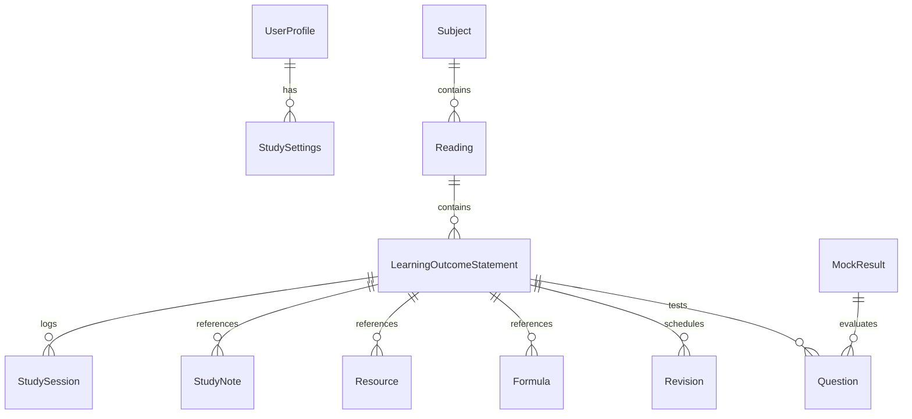

# DATABASE SCHEMA: CFA Level III Operating System

This document outlines the logical entity-relationship schema, storage design, and Firebase Firestore collection planning for the platform.

---

## 1. Storage Architecture

The platform operates on a **Local-First, Cloud-Synced** philosophy.

```
┌──────────────────────────────────────┐
│            REACT VIEWS               │
└──────────────────┬───────────────────┘
                   │
                   ▼
┌──────────────────────────────────────┐
│           APP STATE CONTEXT          │
└──────────────────┬───────────────────┘
                   │ (Read / Write)
                   ▼
┌──────────────────────────────────────┐
│         STORAGE SERVICE LAYER        │
└────────┬───────────────────┬─────────┘
         │                   │
         ▼ (Local Cache)     ▼ (Cloud Sync - Future)
 ┌───────────────┐   ┌────────────────┐
 │ localStorage  │   │ Firebase       │
 │ / IndexedDB   │   │ Firestore      │
 └───────────────┘   └────────────────┘
```

* **Current Implementation**: Global context state backed up synchronously into standard browser `localStorage` under keys `cfa_subjects`, `cfa_readings`, `cfa_los`, `cfa_notes`, `cfa_resources`, `cfa_activities`, `cfa_settings`, and `cfa_current_session`.
* **Intermediate Step**: Planned transition to IndexedDB (via Dexie.js) to manage larger files and complex compound queries without blocking the main browser thread.
* **Production target**: Bidirectional synchronization with Firebase Cloud Firestore.

---

## 2. Entity Relationship Diagram



---

## 3. Schema Definitions

### Users & Settings

#### `users` (Firestore collection) / `UserProfile`
* `id`: string (UUID or Firebase Auth UID)
* `name`: string
* `email`: string
* `avatarUrl`: string (optional)
* `joinedDate`: string (ISO datetime)
* `streakDays`: number

#### `settings` (Firestore document inside user profile) / `StudySettings`
* `theme`: 'light' | 'dark'
* `examDate`: string (YYYY-MM-DD)
* `targetDailyHours`: number
* `preferredSessionLength`: number (minutes)
* `notificationsEnabled`: boolean
* `notificationPreferences`: { email: boolean, push: boolean, streakReminders: boolean }
* `aiModel`: string (optional)
* `aiPersona`: string (optional)
* `aiStreamingEnabled`: boolean

---

### Curriculum Hierarchy

#### `subjects` / `Subject`
* `id`: string
* `level`: 'Level I' | 'Level II' | 'Level III'
* `name`: string
* `description`: string
* `code`: string (e.g. "PM", "FI", "EQ")
* `cfaWeight`: string (e.g. "35-40%")
* `totalHoursEstimate`: number

#### `readings` / `Reading`
* `id`: string
* `subjectId`: string (FK -> subjects)
* `number`: number (Reading number)
* `title`: string
* `description`: string
* `topicArea`: string
* `estimatedHours`: number
* `cfaWeight`: string (optional)
* `difficulty`: 'Easy' | 'Medium' | 'Hard' | null

#### `learningOutcomeStatements` / `LearningOutcomeStatement`
* `id`: string
* `readingId`: string (FK -> readings)
* `code`: string (e.g., "7.a")
* `statement`: string
* `readingName`: string
* `subject`: string (Subject name or ID)
* `topicArea`: string
* `estimatedHours`: number
* `difficulty`: 'Easy' | 'Medium' | 'Hard' | null
* `cfaWeight`: string (optional)
* `status`: 'Not Started' | 'In Progress' | 'Completed'
* `confidence`: 1 | 2 | 3 | 4 | 5 | null
* `actualHours`: number
* `timeSpent`: number (minutes)
* `revisionCount`: number
* `lastReviewed`: string (ISO datetime string, optional)
* `nextReview`: string (ISO date string, YYYY-MM-DD, optional)
* `practiceQuestionsAttempted`: number
* `practiceAccuracy`: number (percentage, 0-100)
* `mockExamReferences`: string[]
* `relatedFormulas`: string[] (FK -> formulas)
* `relatedNotes`: string[] (FK -> studyNotes)
* `relatedResources`: string[] (FK -> resources)
* `relatedLOS`: string[] (Self-references)
* `bookmarked`: boolean
* `aiSummary`: string (optional)
* `aiExplanation`: string (optional)
* `aiWeaknessScore`: number (0-100, optional)

---

### Candidate Execution Data

#### `studySessions` / `StudySession`
* `id`: string
* `startTime`: string (ISO datetime)
* `endTime`: string (ISO datetime, optional)
* `durationMinutes`: number
* `linkedSubjectId`: string (FK -> subjects, optional)
* `linkedReadingId`: string (FK -> readings, optional)
* `linkedLOSId`: string (FK -> learningOutcomeStatements, optional)
* `notesAddedIds`: string[] (FK -> studyNotes)
* `resourcesUsedIds`: string[] (FK -> resources)
* `mentalFocusScore`: number (1-10)
* `confidenceBefore`: number | null (1-5)
* `confidenceAfter`: number | null (1-5)
* `status`: 'Completed' | 'Paused' | 'Cancelled'

#### `studyNotes` / `StudyNote`
* `id`: string
* `title`: string
* `content`: string (Markdown text)
* `createdTime`: string (ISO datetime)
* `updatedTime`: string (ISO datetime)
* `linkedSubjectId`: string (FK -> subjects, optional)
* `linkedReadingId`: string (FK -> readings, optional)
* `linkedLOSId`: string (FK -> learningOutcomeStatements, optional)
* `linkedResourceId`: string (FK -> resources, optional)
* `relatedFormula`: string[] (FK -> formulas)
* `relatedResources`: string[] (FK -> resources)
* `bookmarks`: string[]
* `pinned`: boolean
* `isFavorite`: boolean
* `versionHistory`: Array<{ timestamp: string, content: string, title: string }>

#### `resources` / `Resource`
* `id`: string
* `name`: string
* `category`: ResourceCategory (enum: Curriculum PDFs, Schweser, Personal Notes, Formula Sheets, Mind Maps, Videos, Question Banks, Mocks, Flashcards, Bookmarks)
* `url`: string
* `fileType`: string (pdf, mp4, xlsx, link)
* `fileSize`: string (optional)
* `dateAdded`: string (ISO datetime)
* `linkedSubjectId`: string (FK -> subjects, optional)
* `linkedReadingId`: string (FK -> readings, optional)
* `linkedLOSId`: string (FK -> learningOutcomeStatements, optional)
* `pages`: number (optional)
* `tags`: string[]
* `personalRating`: number (1-5)
* `isFavorite`: boolean
* `description`: string (optional)

#### `formulas` / `Formula`
* `id`: string
* `name`: string
* `latexExpression`: string (LaTeX code)
* `description`: string
* `linkedSubjectId`: string (FK -> subjects, optional)
* `linkedReadingId`: string (FK -> readings, optional)
* `linkedLOSId`: string (FK -> learningOutcomeStatements, optional)
* `variables`: Array<{ symbol: string, meaning: string }>
* `isMemorized`: boolean

#### `revisions` / `Revision`
* `id`: string
* `losId`: string (FK -> learningOutcomeStatements)
* `timestamp`: string (ISO datetime)
* `leitnerBox`: number (1-5)
* `nextReviewDate`: string (YYYY-MM-DD)
* `elapsedTimeSeconds`: number
* `confidenceShift`: { from: number, to: number }

---

## 4. Firestore Security Rules Blueprint

To ensure data integrity, collection rules in Firestore will restrict writes to authenticated resource owners:

```javascript
rules_version = '2';
service cloud.firestore {
  match /databases/{database}/documents {
    match /users/{userId} {
      allow read, write: if request.auth != null && request.auth.uid == userId;
      
      match /sessions/{sessionId} {
        allow read, write: if request.auth != null && request.auth.uid == userId;
      }
      match /notes/{noteId} {
        allow read, write: if request.auth != null && request.auth.uid == userId;
      }
      match /resources/{resourceId} {
        allow read, write: if request.auth != null && request.auth.uid == userId;
      }
      match /formulas/{formulaId} {
        allow read, write: if request.auth != null && request.auth.uid == userId;
      }
      match /revisions/{revisionId} {
        allow read, write: if request.auth != null && request.auth.uid == userId;
      }
    }
  }
}
```

---

## 5. Repository Layer & Runtime Indexing Maps

To optimize performance and avoid $O(n)$ array scans during relationship resolution, the platform utilizes a memoized Repository Layer. Each repository indexes source collections on initialization into highly targeted hash maps:

| Repository Class | Primary Index | Secondary Indexes / Mappings |
| :--- | :--- | :--- |
| **SubjectRepository** | `Map<SubjectId, Subject>` | - |
| **ReadingRepository** | `Map<ReadingId, Reading>` | `Map<SubjectId, Reading[]>`<br>`Map<Difficulty, Reading[]>`<br>`Map<Status, Reading[]>` |
| **LOSRepository** | `Map<LOSId, LearningOutcomeStatement>` | `Map<ReadingId, LearningOutcomeStatement[]>`<br>`Map<Status, LearningOutcomeStatement[]>`<br>`Map<Difficulty, LearningOutcomeStatement[]>` |
| **FormulaRepository** | `Map<FormulaId, Formula>` | `Map<ReadingId, Formula[]>`<br>`Map<SubjectId, Formula[]>` |
| **ResourceRepository** | `Map<ResourceId, Resource>` | `Map<LOSId, Resource[]>`<br>`Map<ReadingId, Resource[]>` |
| **NoteRepository** | `Map<NoteId, StudyNote>` | `Map<LOSId, StudyNote[]>`<br>`Map<ReadingId, StudyNote[]>`<br>`Map<FormulaId, StudyNote[]>` |
| **StudySessionRepository** | `Map<SessionId, StudySession>` | `Map<ReadingId, StudySession[]>`<br>`Map<LOSId, StudySession[]>` |

