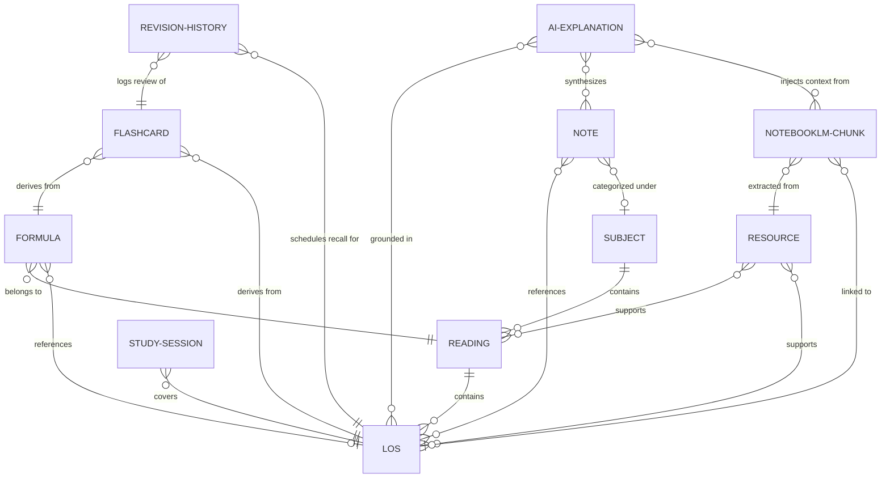

# KNOWLEDGE GRAPH ARCHITECTURE: CFA Level III OS

This document defines how knowledge is structured, indexed, and related within the CFA Level III Operating System. It serves as the authoritative blueprint for the **Knowledge Engine**, guiding all semantic queries, spaced repetition scheduling, and RAG grounding vectors.

---

## 1. Ontology Nodes (Entities)

The knowledge graph is composed of eleven distinct node types, grouped into three operational layers:

```
┌────────────────────────────────────────────────────────┐
│ 1. CURRICULUM LAYER (Static Syllabus Structure)        │
│    - Subject, Reading, Learning Outcome Statement (LOS)│
├────────────────────────────────────────────────────────┤
│ 2. CANDIDATE WORKSPACE LAYER (User Knowledge Assets)  │
│    - Formula, Study Note, Resource, Flashcard          │
├────────────────────────────────────────────────────────┤
│ 3. COGNITIVE LEDGER LAYER (Telemetry & Analytics)      │
│    - Study Session, AI Explanation, NotebookLM Chunk,  │
│      Revision History                                  │
└────────────────────────────────────────────────────────┘
```

### Node Schema Descriptions:
1. **Subject**: High-level CFA syllabus topic areas (e.g., *Fixed Income*, *Equity Portfolio Management*).
2. **Reading**: Specialized sub-topics within a subject containing theoretical chapters.
3. **LOS (Learning Outcome Statement)**: The atomic, testable syllabus criteria defined by the CFA Institute.
4. **Formula**: Math equations, latex strings, and parameter lists required for calculation.
5. **Study Note**: Rich text markdown documentation created by the candidate during review.
6. **Resource**: External study files, official curriculum PDFs, question banks, or bookmarks.
7. **Flashcard**: Active recall units containing a question/hide-reveal variable and a response answer.
8. **Study Session**: Recorded active stopwatch durations, focus logs, and user activity blocks.
9. **AI Explanation**: Dynamic tutor text generated locally or via cloud models.
10. **NotebookLM Chunk**: Semantically vectorized text segments extracted from uploaded resources.
11. **Revision History**: Leitner schedules and SM-2 logs representing historical active recall attempts.

---

## 2. Graph Hierarchy

Knowledge is represented as an tree hierarchy at the structural level, but behaves as an interconnected web at the relational level.

```
Subject (Root Area)
 │
 └── Readings (Theoretical Modules)
      │
      ├── LOS (Atomic Testable Checkpoints)
      │    │
      │    ├── Formulae (Math Models)
      │    │
      │    ├── Notes (Candidate Outlines)
      │    │
      │    ├── Resources (Supporting PDFs / Media)
      │    │
      │    ├── Study Sessions (Logged Duration Blocks)
      │    │
      │    ├── Flashcards (Active Recall Questions)
      │    │
      │    ├── AI Explanations (Grounding Tutors)
      │    │
      │    ├── NotebookLM Chunks (Vectorized Chunks)
      │    │
      │    └── Revision History (SM-2 Ledger)
```

---

## 3. Relationship Matrix (Edges)

Directional edges dictate how nodes interact. They prevent ad-hoc database mutations and enforce strict referential boundaries.



| Source Node | Edge (Relationship) | Target Node | Cardinality | Purpose |
| :--- | :--- | :--- | :--- | :--- |
| **Formula** | `belongs to` | **Reading** | Many-to-One | Direct curriculum ownership of math models. |
| **Formula** | `references` | **LOS** | Many-to-One (Optional) | Links a formula to the specific outcome testing it. |
| **Reading** | `contains` | **LOS** | One-to-Many | Direct composition of syllabus outcomes. |
| **Note** | `references` | **LOS** | Many-to-Many | Candidate's annotations mapping back to syllabus checkpoints. |
| **Note** | `categorized under` | **Subject** | Many-to-One | General context mapping for global organization. |
| **Study Session**| `covers` | **LOS** | Many-to-One (Optional) | Telemetry matching elapsed time to specific syllabus targets. |
| **Resource** | `supports` | **Reading** | Many-to-Many | Scopes external documents to theoretical modules. |
| **Resource** | `supports` | **LOS** | Many-to-Many | Scopes external documents to atomic test objectives. |
| **Flashcard** | `derives from` | **Formula** | Many-to-One (Optional) | Active recall deck checking equation recall. |
| **Flashcard** | `derives from` | **LOS** | Many-to-One (Optional) | Active recall deck checking conceptual objectives. |
| **Revision History**| `logs review of` | **Flashcard** | Many-to-One | Tracks Leitner confidence changes over time. |
| **Revision History**| `schedules recall for`| **LOS** | Many-to-One | Logs SM-2 algorithm intervals for syllabus outcomes. |
| **NotebookLM Chunk**| `extracted from`| **Resource** | Many-to-One | Traces vector passages back to source documents. |
| **NotebookLM Chunk**| `linked to` | **LOS** | Many-to-One | Grounds vector chunks to specific syllabus objectives. |
| **AI Explanation**| `grounded in` | **LOS** | Many-to-Many | Ensures tutor advice answers explicit syllabus objectives. |
| **AI Explanation**| `synthesizes` | **Note** | Many-to-Many | Direct LLM retrieval from candidate-authored text. |
| **AI Explanation**| `injects context from`| **NotebookLM Chunk** | Many-to-Many | Grounds local AI generation using semantic vector search. |

---

## 4. Query & Traversal Scenarios

The blueprint enables four key retrieval patterns for the platform's engines:

### A. Spaced Repetition (Revision Queue Retrieval)
To assemble the daily active recall dashboard queue:
1. Traverse `Revision History` where `nextReviewDate <= Today`.
2. Map target `LOS` or `Flashcard` nodes.
3. Fetch linked `Formula` equations and related `Notes` to present as instant reference cues if the candidate fails the recall check.

### B. Grounded AI Tutor Prompts (RAG Context Synthesis)
To explain a complex learning objective using local LLMs:
1. Identify the target `LOS` node.
2. Query all linked `Note` records (candidate annotations) + `NotebookLM Chunk` vectors extracted from the target PDF `Resource`.
3. Assemble the prompt context:
   ```
   [System Guidelines: Explain this objective grounded only in the context below...]
   Syllabus Goal: {LOS.statement}
   Candidate Notes: {Notes[].content}
   Vector Chunks: {NotebookLMChunks[].text}
   ```

### C. Active Cockpit Focus Selector (Neglect Vectors)
To select the active study target:
1. Look up the candidate's historical `Study Session` durations.
2. Filter the `Subject` list with the lowest accumulated duration (Neglect Area).
3. Find the first uncompleted `Reading` -> `LOS` in the target Subject, referencing prerequisites defined in the relationship index.
4. Present the selected `LOS` in the Today's Mission cockpit along with pre-loaded `Resources` and `Formulas`.
